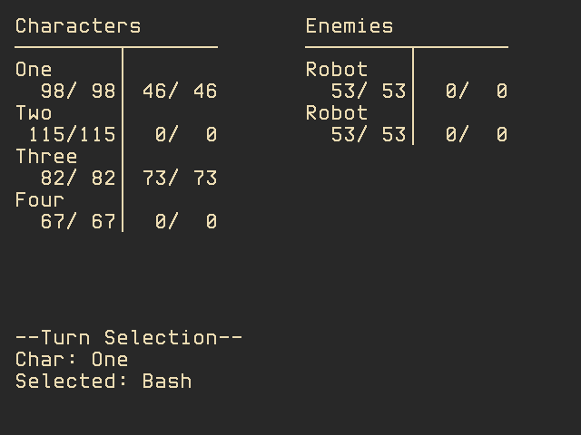

# Six

## The sixth attempt at making the same battle engine

As indicated in its name, this is the sixth iteration of me cloning Mother 3's battle engine; I
should stop counting. This iteration started as I wanted to give a try to making an "old styled"
project in Rust to see how many walls I would run into before having something playable and it
_quickly_ turned into "hey, let's do the same damn thing because I don't have any ideas
anymore".

## Installation

This is a project that depends on [Tetra](https://github.com/17cupsofcoffee/tetra/). To compile
and run the project, it's suggested to either the SDL2's libraries as explained in tetra's
documentation [here](https://tetra.seventeencups.net/installation/).

## What remains to do/polish

- Code structure (Does it show that badly it's my first serious Rust project?)
- Different kind of actions (item effects, special moves)
  - The current structure is vagely planned to have actions that aren't instant to allow
    animations and stuff.
  - Determine the data structure to identity and flesh out actions (targeting, stat, skill set,
    animation, etc...).
  - Create actions (or borrow the ones from the Mother series `:-°`)
- AI (scripting PoC would be a must, if purely useless in the context of a prototype)
- Animation
- Textbox ([Textbox](https://github.com/Eiyeron/Textbox) 2 - Electric Boogaloo)
- Graphics?
- Sounds? What is sound anyway?

## Used/Unused Asset attribution

### Images

- blowharder.png (unused, kept for later) : [Blowharder 2](https://opengameart.org/content/blowhard-2-blow-harder) by
  surt (CC0)
- robot.png (ditto) : Done by myself for the fourth iteration (the one in Haxe/Haxeflixel) of that
  battle engine cloning woes .

### Fonts

Both fonts (x14y24pxHeadUpDaisy.ttf and x16y32GridGazer.ttf) are designed by
[hicc](twitter.com/hicchicc).Licence and more fonts are available
[here](http://www17.plala.or.jp/xxxxxxx/00ff/).

Just for reference, here's a copy of the licence found on the site on 2021-04-08:

> フォントから生成されるデータは全て無償で利用できます。表現する内容・媒体も問いません。
> .ttf ファイルを同梱してのゲームリリースや、商用利用も可能です。
>
> 加工・改変・再配布も可能となっていますが、フォントの著作権は放棄しておりません。
> 当サイトで配布するフォント及び改変データの著作権は、全て患者長ひっくが有します。
> 加工・改変の有無に関わらず、フォントの著作者であることを主張することはできません。
> （よって、フォントそのものを販売したり、それに近い行為は違法性が生じますので、これを禁じます。）
>
> フォント利用の際の出典・クレジット表記などは、して頂いても、しなくても、どちらでも構いません。
> いかなる媒体に使用・表記された場合でも、その内容や思想には関知せず、一切の責任を負いません。
> また、万一フォントを利用したことによる損害が生じることがあっても、一切補償しません。
>
> この規約は予告なく変更する場合がありますが、フォントの利用料を請求する変更は行いません。
>
> フォント制作・著作 / Web サイト制作・管理
> © 2018-2019 hicc 患者長ひっく
